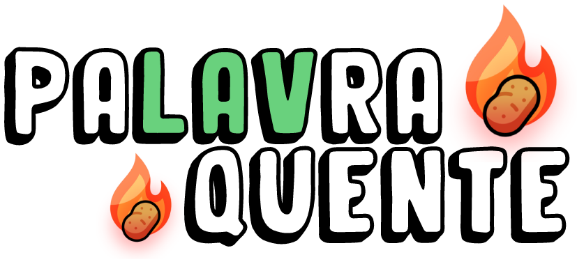

Um jogo de browser inspirado nos jogos como: [Termo](https://www.term.ooo/) e [Wordle](https://www.nytimes.com/games/wordle/index.html). Combinado com a 'mecânica' da jogo infantil **batata-quente**, foi criado o _Palavra Quente_, um multiplayer no qual você e mais 5 pessoas podem se juntar para competir quem sabe mais palavras, mais cuidado... **O tempo diminui a cada rodada!!**

## Tecnologias:

O jogo foi inteiramente construído com **React e Tailwind**, seu backend é feito usando **Express e SocketIO**, o banco de dados usado é o **FaunaDB**

## ❗ Atenção:

Como o jogo esta sendo completamente desenvolvido por mim como um hobby, ele pode demorar um pouco mais do que o desejado. Todas as suas atualizações podem ser acompanhadas pelo meu [GitHub](https://www.github.com/Matelz). Obrigado pela compreensão, espero poder entregar o melhor possível 💛
